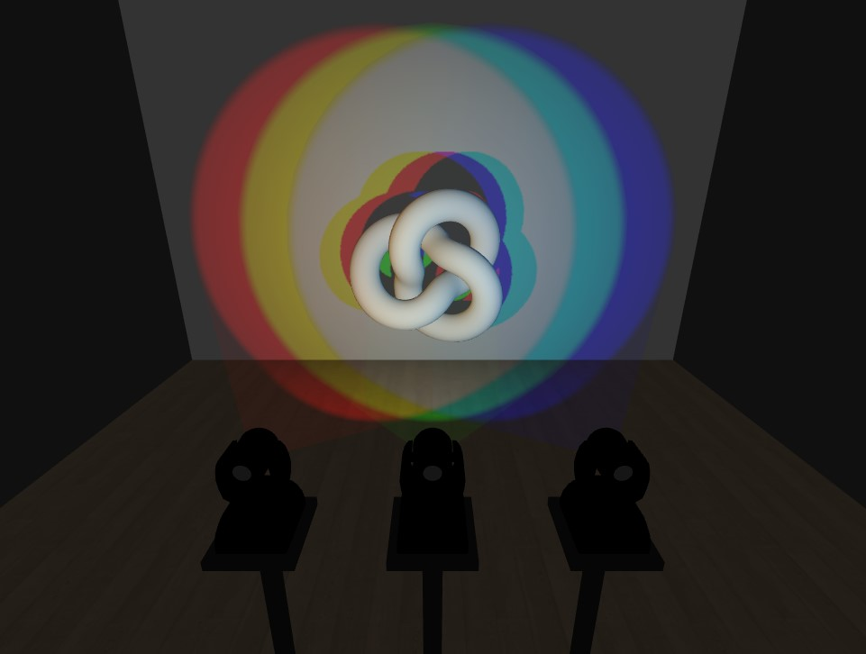

# Three.js Demo
This demo renders a simple scene demonstrating the multi-colored shadow effect seen in photography.

## Installation
Clone this project locally:  
`git clone https://github.com/ethan-logue/threejs-demo.git`

In project directory:  
`npm i`

Then run:  
`npx vite`